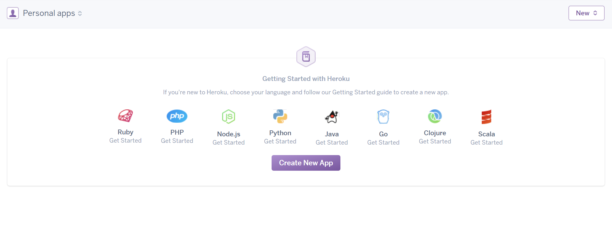
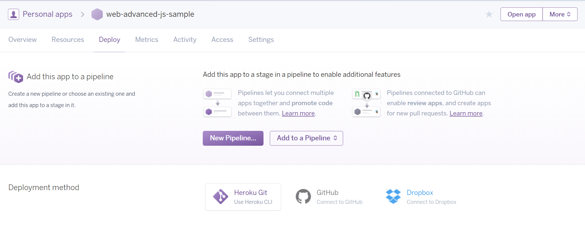

## Concepts
IaaS - Infrastructure as a Service

Deployment
- Github pages
- AWS EC2
- Heroku
- Linode
- Azure
- Digital Ocean
- Cloud9

## Steps
- Set up an account on Heroku
- Install [Heroku Toolbelt](https://devcenter.heroku.com/articles/heroku-cli)

```
heroku --version
heroku-cli/5.6.13-0030acd (windows-amd64) go1.7.4

```

- Login to your account

```
heroku login
Enter your Heroku credentials.
Email: jaskiratr@gmail.com
Password (typing will be hidden):
Logged in as jaskiratr@gmail.com
```

- Find the most common commands here: [Heroku CLI Usage](https://devcenter.heroku.com/articles/using-the-cli)
- Login and create a new app





- Alternatively, run `heroku apps:create` in the folder.
- Go to the **Settings** page of the application, and grab the Git URL

```sh
git init
heroku git:remote -a YOUR_HEROKU_APP_NAME

# Example
heroku git:remote -a web-advanced-js-sample
```

- Create a boilerplate express application 

```sh
express --pug
npm install
```

- Add `.gitignore` with to exclude `node_modules`
- Have the server listen to local port 3000

```js
# Append to app.js
app.set('port', (process.env.PORT || 3000))
app.listen(app.get('port'), () => {
  console.log('Node app is running on port', app.get('port'))
})
```

- Run the server with `node app.js` and browse to localhost:3000 to confirm that it works locally
-For a Node.js App, Heroku needs the following:
	+ Port Specification: Heroku needs to be able to specify its own port `(process.env.PORT || 3000)`
	+ List of Dependencies: Include package.json
	+ [Procfile](https://devcenter.heroku.com/articles/procfile) : Mechanism for declaring what commands are run by your application's dynos
- Create a file called Procfile with following contents `web: node app.js` This tells heroku to run the command node app.js when your app is requested over the web.
- Deploy to Heroku

```sh
git add .
git commit -m "init"
git push heroku master
```

Navigate to the URL of the app to confirm it works. `https://web-advanced-js-sample.herokuapp.com/`


## Readings
- [Cloud Platforms Compared](http://selbielabs.com/cloud-platforms-compared/)
- [Node.js Deployment with Heroku & Docker](https://blog.risingstack.com/node-hero-deploy-node-js-heroku-docker/)
