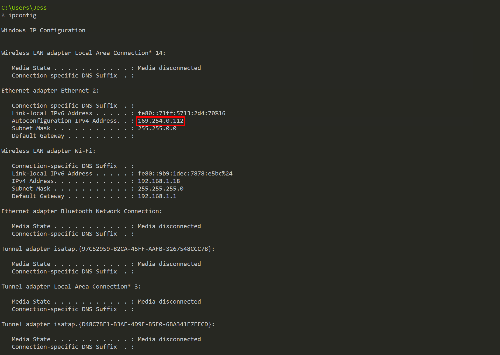
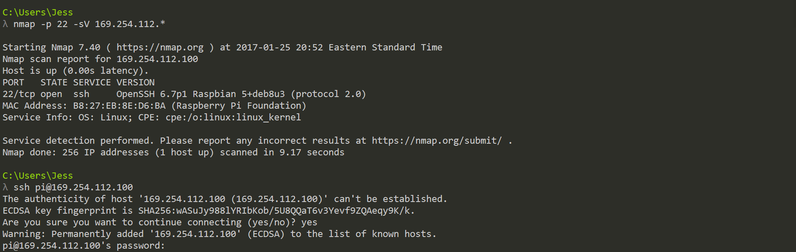

## Concepts
Raspberry Pi Setup
Linux Node.js

## Readings
RbPi headless setup: http://blog.self.li/post/63281257339/raspberry-pi-part-1-basic-setup-without-cables
Download Raspbian: https://www.raspberrypi.org/downloads/raspbian/
SD Card Setup: http://trendblog.net/install-raspbian-sd-card-os-x-windows/
EXT4 R/W 
	- Windows: https://www.paragon-software.com/home/extfs-windows-pro/download.html
	- Mac: http://www.paragon-drivers.com/extfs-mac/

http://workshop.raspberrypiaustralia.com/
https://www.raspberrypi.org/documentation/remote-access/ssh/

--------------------------------------------------------
Ethernet Setup (Windows)
Ref: https://www.youtube.com/watch?v=LS96JxvzYGw

Flash the image onto SD Card
In your terminal enter `ipconfig` and find out the series of autoconfigured IP addresses for your ethernet port.

Eg. 169.254.0.112

Open the 'boot' partition
Edit 'cmdline.txt' and add `ip: 169.254.xxx.xxx`. Replace xx with your choice.
Create a new file `ssh` with no extension in the root of the 'boot' drive. Required to open ssh port on the pi
Eject the card and load it in your Pi
Power it up connect via direct ethernet
Verify that the ssh port is open on your Pi using NMAP `nmap -p 22 -sV 169.254.112.*`
Ssh into it using `pi@169.254.xxx.xxx`. Username: pi and Password: raspberry


You may now config WIFI connection

```
cd /path/to/your/sd/card/
sudo nano etc/wpa_supplicant/wpa_supplicant.conf
```

Add the following

```
network={
    ssid="your-network-ssid-name"
    psk="your-network-password"
}
```

'ctrl+x' followed by 'y'